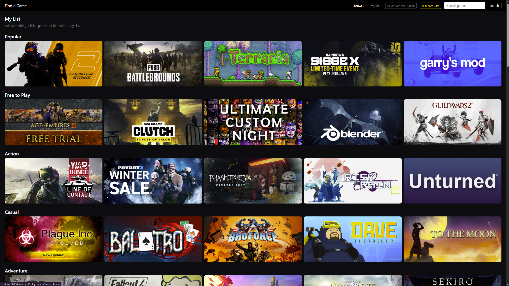

# Steam Game Finder
A Java web application for discovering and browsing video games using data imported from Steam.

## Author
Isaac Ericson

## Features
- Browse a large game library (125,000+ games)
- Netflix-style homepage with category rows (Popular, Free to Play, Action, RPG, and more)
- Dedicated category pages with infinite scroll
- Free-text search
- Detailed game info page and modal, including a screenshot carousel
- Save games to a session-based "My List"
- Optional adult content filtering

## Built With
- Java
- Jakarta EE
- JSP
- Servlets
- Maven
- Apache Tomcat
- MySQL

## Getting Started

### Prerequisites
- Java 21+
- Apache Tomcat 11
- MySQL 8+
- Maven

### Installation
1. Clone the repository.
2. Download `games.csv` from the Releases page and place it in `src/main/resources/`.
3. Open the project in NetBeans.
4. Make sure MySQL is running locally. Defaults to user `root`, password `admin` on `localhost:3306`. If your MySQL configuration is different, either edit the default values in `DatabaseConnection.java` or provide `db.url`, `db.user`, and `db.password` as Tomcat VM options.
5. Run the project on Tomcat. The database, tables, and game data are created automatically on first startup.

## Screenshots
**Homepage**, with an empty and a populated My List:

**Category page**, browsing the `Indie` tag:

**Game details**, for `Terraria`:

**Search**, by game name and by tags:

